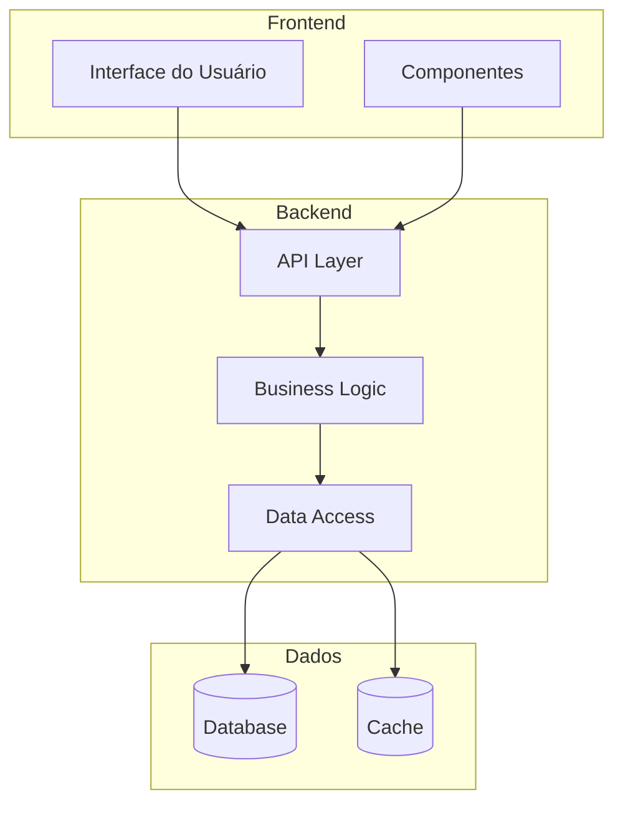
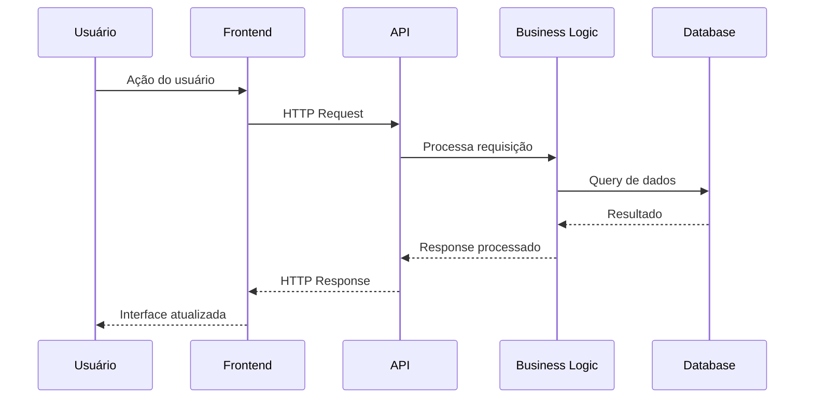

# Template: Arquitetura do Sistema

## Visão Geral da Arquitetura

## Camadas da Aplicação

### Frontend
- **Tecnologia**: [Framework utilizado]
- **Responsabilidades**:
  - Interface com usuário
  - Validação de entrada
  - Comunicação com API

### API Layer  
- **Tecnologia**: [Framework utilizado]
- **Responsabilidades**:
  - Endpoints REST/GraphQL
  - Autenticação e autorização
  - Validação de requests
  - Serialização de dados

### Business Logic
- **Responsabilidades**:
  - Regras de negócio
  - Processamento de dados
  - Orquestração de operações
  - Integração com serviços externos

### Data Access
- **Responsabilidades**:
  - Acesso ao banco de dados
  - Cache management
  - Data mapping
  - Queries e persistência

## Padrões Arquiteturais

### [Padrão 1]
- **Descrição**: Como é implementado
- **Benefícios**: Vantagens obtidas
- **Exemplo**: Onde é aplicado

### [Padrão 2]
- **Descrição**: Como é implementado
- **Benefícios**: Vantagens obtidas  
- **Exemplo**: Onde é aplicado

## Fluxo de Dados

## Decisões Arquiteturais

### [Decisão 1: Título]
- **Contexto**: Situação que levou à decisão
- **Decisão**: O que foi decidido
- **Consequências**: Impactos positivos e negativos
- **Status**: Aceita/Rejeitada/Superseded

## Integrações Externas

### [Serviço/API Externa 1]
- **Propósito**: Para que é usado
- **Protocolo**: REST/SOAP/GraphQL
- **Autenticação**: Tipo de auth
- **Endpoints**: Principais endpoints utilizados

## Segurança

### Autenticação
- **Método**: JWT/OAuth2/Sessions
- **Implementação**: Como está implementado
- **Validade**: Tempo de vida dos tokens

### Autorização  
- **Modelo**: RBAC/ACL/Custom
- **Implementação**: Como são verificadas as permissões
- **Recursos protegidos**: O que requer autorização

### Proteção de Dados
- **Criptografia**: Algoritmos utilizados
- **Dados sensíveis**: Como são protegidos
- **Compliance**: LGPD/GDPR/outros