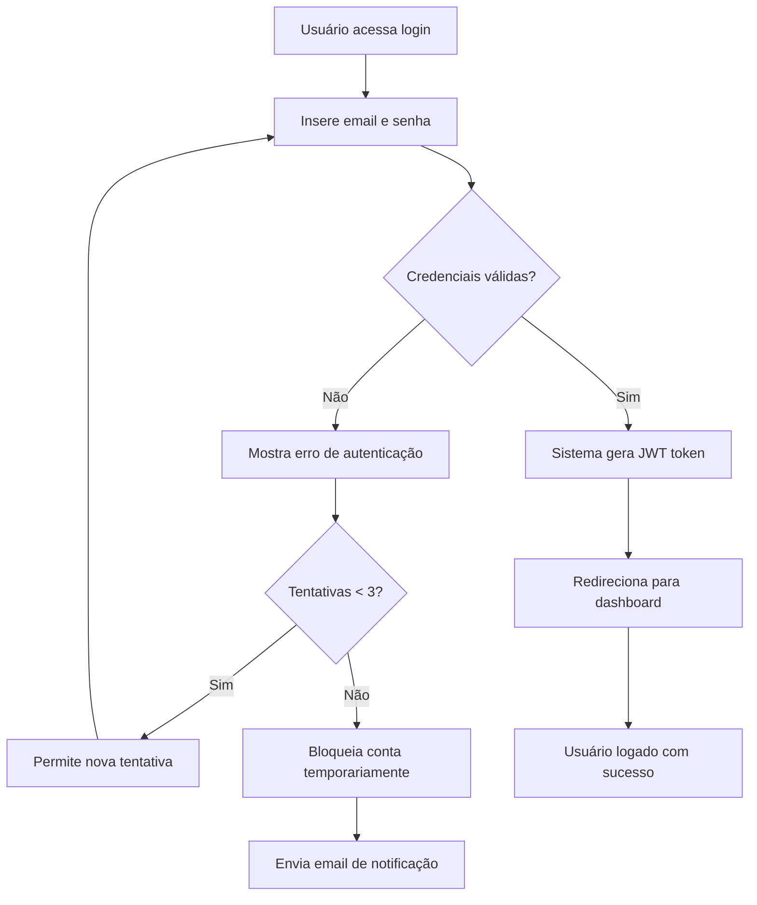
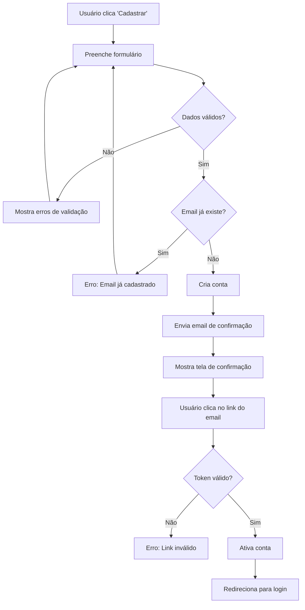
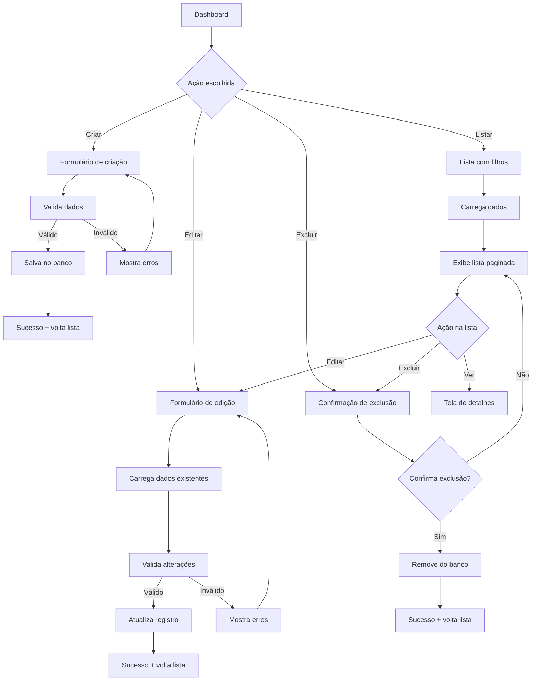
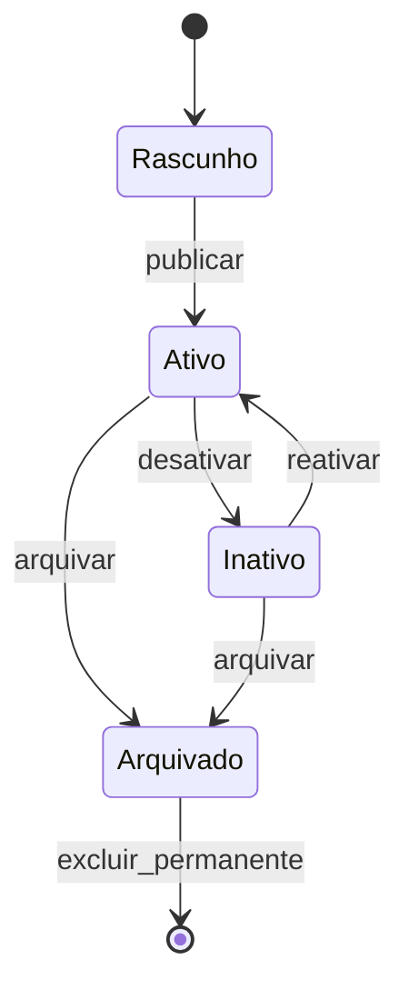

# Template: Fluxos de Usuário

## Índice de Fluxos

1. [Fluxo de Autenticação](#fluxo-de-autenticação)
2. [Fluxo de Cadastro](#fluxo-de-cadastro)
3. [Fluxo Principal (CRUD)](#fluxo-principal-crud)
4. [Fluxo de Recuperação de Senha](#fluxo-de-recuperação-de-senha)

---

## Fluxo de Autenticação

### Visão Geral
Processo pelo qual o usuário acessa o sistema fornecendo credenciais válidas.

### Diagrama do Fluxo


### Detalhamento dos Passos

#### 1. Usuário acessa tela de login
- **Input**: URL da aplicação
- **Output**: Formulário de login
- **Validações**: Verificar se usuário já está logado

#### 2. Inserção de credenciais
- **Input**: Email e senha
- **Validações client-side**:
  - Email em formato válido
  - Senha não vazia
  - Campos obrigatórios preenchidos

#### 3. Validação server-side
- **Processo**: 
  - Verificar se email existe no banco
  - Comparar hash da senha
  - Verificar se conta não está bloqueada
- **Output**: Token JWT ou mensagem de erro

#### 4. Sucesso - Geração de token
- **Processo**:
  - Criar JWT com dados do usuário
  - Definir tempo de expiração (2h)
  - Registrar log de acesso
- **Output**: Token + dados básicos do usuário

#### 5. Erro - Tratamento de falhas
- **Tipos de erro**:
  - Credenciais inválidas
  - Conta bloqueada
  - Conta inexistente
- **Processo**: Incrementar contador de tentativas

### Regras de Negócio
- **Bloqueio**: Após 3 tentativas incorretas, bloquear por 15 minutos
- **Token**: Expire em 2 horas de inatividade
- **Logs**: Registrar todas as tentativas de login
- **Notificação**: Email em caso de bloqueio de conta

### Casos de Uso Relacionados
- UC001 - Fazer Login
- UC002 - Bloquear Conta por Tentativas
- UC003 - Desbloquear Conta

---

## Fluxo de Cadastro

### Visão Geral
Processo de registro de novo usuário no sistema.

### Diagrama do Fluxo


### Campos do Formulário
- **Nome completo** (obrigatório, 2-100 chars)
- **Email** (obrigatório, formato válido, único)
- **Senha** (obrigatório, min 8 chars, 1 maiúscula, 1 número)
- **Confirmação da senha** (deve ser igual à senha)
- **Aceitar termos** (obrigatório, checkbox)

### Validações
#### Client-side:
- Formato do email
- Força da senha
- Confirmação de senha
- Campos obrigatórios

#### Server-side:
- Email único no sistema
- Senha atende critérios de segurança
- Rate limiting (máximo 5 tentativas/minuto)

### Email de Confirmação
```
Assunto: Confirme seu cadastro

Olá [Nome],

Para completar seu cadastro, clique no link abaixo:
[Link de confirmação]

Este link expira em 24 horas.

Se você não se cadastrou, ignore este email.
```

### Regras de Negócio
- **Confirmação**: Conta criada como inativa até confirmar email
- **Expiração**: Link de confirmação válido por 24 horas
- **Rate Limiting**: Máximo 5 cadastros por IP por hora
- **Dados**: Nome e email ficam em minúsculas

---

## Fluxo Principal (CRUD)

### Visão Geral
Operações básicas de Create, Read, Update, Delete para a entidade principal.

### Diagrama de CRUD


### Operações Detalhadas

#### CREATE (Criação)
1. **Acesso**: Botão "Novo" na lista
2. **Formulário**: Campos obrigatórios/opcionais
3. **Validação**: Client + server-side
4. **Persistência**: Salvar no banco com audit trail
5. **Feedback**: Mensagem de sucesso + redirecionamento

#### READ (Leitura)
1. **Lista**: Paginada com filtros e busca
2. **Detalhes**: Visualização completa do item
3. **Filtros**: Por status, data, categoria
4. **Busca**: Texto livre em campos principais
5. **Ordenação**: Por diferentes colunas

#### UPDATE (Atualização)
1. **Acesso**: Botão "Editar" na lista/detalhe
2. **Carregamento**: Pré-preencher formulário
3. **Validação**: Verificar mudanças e validar
4. **Persistência**: Atualizar com controle de versão
5. **Feedback**: Mensagem de sucesso

#### DELETE (Exclusão)
1. **Acesso**: Botão "Excluir" na lista/detalhe
2. **Confirmação**: Modal de confirmação
3. **Validação**: Verificar dependências
4. **Exclusão**: Soft delete ou hard delete
5. **Feedback**: Mensagem de confirmação

### Estados dos Registros


### Regras de Negócio
- **Permissões**: Apenas owner ou admin pode editar/excluir
- **Validação**: Campos obrigatórios conforme regra de negócio
- **Auditoria**: Log de todas as operações
- **Soft Delete**: Registros não são removidos fisicamente
- **Versionamento**: Manter histórico de alterações

---

## Mensagens e Feedback

### Tipos de Mensagem
- **Sucesso** (verde): "Operação realizada com sucesso"
- **Erro** (vermelho): "Ocorreu um erro. Tente novamente"
- **Aviso** (amarelo): "Atenção: verifique os dados"
- **Info** (azul): "Informação importante"

### Localização
- **Toast**: Mensagens temporárias (3-5 segundos)
- **Inline**: Erros de validação nos campos
- **Modal**: Confirmações importantes
- **Banner**: Avisos persistentes

### Textos Padrão
```javascript
const MENSAGENS = {
  sucesso: {
    criar: "Registro criado com sucesso",
    atualizar: "Registro atualizado com sucesso", 
    excluir: "Registro excluído com sucesso"
  },
  erro: {
    validacao: "Verifique os campos destacados",
    permissao: "Você não tem permissão para esta ação",
    servidor: "Erro interno. Tente novamente em alguns minutos"
  }
}
```