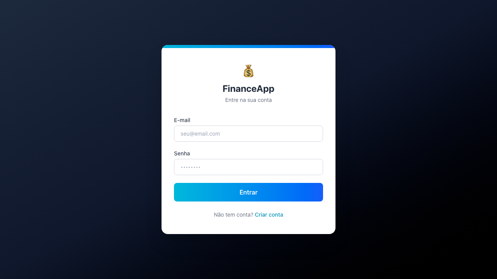
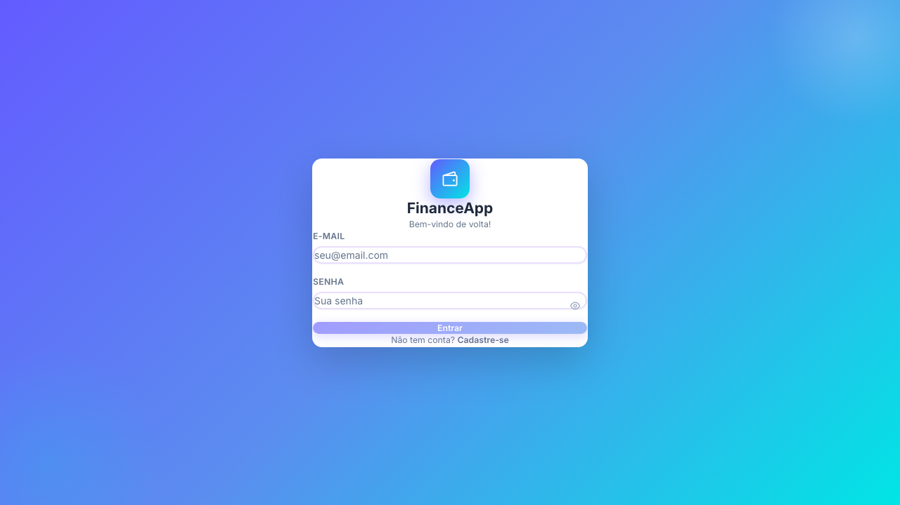
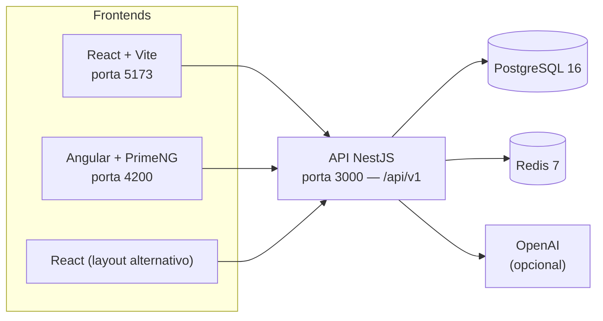
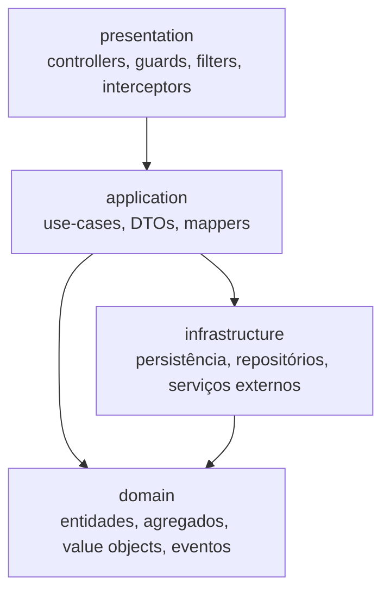

# Gestão Financeira Pessoal e Familiar

Aplicação web para organizar as finanças de uma pessoa ou de uma família em um só lugar: contas, transações, categorias, orçamentos, metas, relatórios, importação de extratos bancários e um módulo de inteligência artificial que ajuda a categorizar gastos e responder perguntas sobre o próprio dinheiro.

O repositório é um monorepo com **uma API (backend)** e **três aplicações de frontend opcionais** que consomem essa mesma API.

---

## Índice

- [Objetivo do projeto](#objetivo-do-projeto)
- [Funcionalidades](#funcionalidades)
- [Telas](#telas)
- [Como o sistema está organizado](#como-o-sistema-está-organizado)
- [Tecnologias utilizadas](#tecnologias-utilizadas)
- [Estrutura do repositório](#estrutura-do-repositório)
- [Instalação](#instalação)
- [Variáveis de ambiente](#variáveis-de-ambiente)
- [Testes](#testes)
- [Projeto gerado por IA](#projeto-gerado-por-ia)

---

## Objetivo do projeto

O objetivo é dar visibilidade e controle sobre a vida financeira do dia a dia:

- Saber **quanto entra e quanto sai** por mês, por conta e por categoria.
- **Planejar** através de orçamentos por categoria e metas de economia.
- **Reduzir o trabalho manual**, importando extratos bancários (OFX/CSV) e conciliando-os com os lançamentos já registrados.
- **Entender o comportamento financeiro** com relatórios, gráficos e sugestões geradas por IA.
- Permitir o uso **individual ou familiar** — o modelo de dados suporta famílias e membros compartilhando contas e transações.

---

## Funcionalidades

As funcionalidades abaixo correspondem aos módulos efetivamente implementados na API (`/api/v1`) e nas telas dos frontends.

### Autenticação e segurança
- Cadastro e login de usuários com senha protegida por hash (bcrypt).
- Tokens JWT de acesso e de refresh, com logout e endpoint de perfil (`/auth/me`).
- Estratégia de login social com Google (OAuth2) configurável por variáveis de ambiente.
- Proteção das rotas por guard JWT, headers de segurança (Helmet), CORS restrito e rate limiting.
- Dados bancários sensíveis (agência e número da conta) armazenados criptografados com AES-256.
- Tabela de auditoria (`audit_logs`) e exclusão lógica (`deleted_at`) nas tabelas principais.

### Contas
- Cadastro, listagem, edição e remoção de contas.
- Tipos suportados: conta corrente, poupança, cartão de crédito, investimento, dinheiro e outros.
- Saldo, limite de crédito, moeda, cor, ícone e opção de incluir ou não no saldo total.

### Categorias e subcategorias
- Categorias próprias do usuário e categorias padrão do sistema (carregadas por seed).
- Subcategorias vinculadas a cada categoria, com CRUD completo.

### Transações
- Lançamento de **receitas**, **despesas** e **transferências entre contas** (os dois lados da transferência ficam agrupados por um identificador de par).
- Campos de data, descrição, observações, tags, comprovante, método de pagamento (dinheiro, débito, crédito, transferência, PIX, boleto, outros) e status (pendente, confirmada, cancelada, conciliada).
- Suporte a transações recorrentes (agrupadas por `recurring_group_id`).
- Listagem com filtros, edição e exclusão.

### Orçamentos
- Definição de orçamentos, listagem, edição e exclusão.
- Relatório comparando o orçamento planejado com o gasto real.

### Metas financeiras
- Criação e acompanhamento de metas.
- Registro e consulta de contribuições feitas para cada meta.

### Extratos bancários e conciliação
- Importação de extratos em **OFX ou CSV** (upload de arquivo de até 10 MB, vinculado a uma conta).
- Listagem dos extratos importados e dos itens de cada extrato.
- Conciliação item a item com três ações: **associar** a uma transação existente, **criar** uma nova transação ou **ignorar** o item.

### Relatórios e dashboard
- Resumo do dashboard com os números do mês atual.
- Relatório mensal de receitas e despesas.
- Fluxo de caixa por período.
- Relatório de orçamentos versus gastos reais.
- Visualização em gráficos nos frontends.

### Inteligência artificial
- **Sugestão de categoria** para uma transação a partir da descrição e do valor.
- **Insights financeiros** personalizados do mês atual.
- **Previsão de gastos** para o mês seguinte.
- **Chat financeiro** em linguagem natural, com acesso ao contexto do usuário (saldo, receitas, despesas do mês e principais categorias). Quando `OPENAI_API_KEY` está configurada, usa o modelo GPT-3.5-turbo; caso contrário, cai para um motor de regras local baseado nos dados reais do usuário.

---

## Telas

As imagens abaixo são capturas reais geradas pelos testes visuais (Playwright) do projeto.

**Login — frontend React (tema claro)**



**Login — frontend React (tema escuro)**


**Login — frontend Angular**



---

## Como o sistema está organizado



O backend segue **Clean Architecture**, com as camadas separadas em pastas:



---

## Tecnologias utilizadas

### Backend — `financial-management-backend`
| Tecnologia | Uso |
|---|---|
| NestJS 11 + TypeScript | Framework da API REST |
| TypeORM + `pg` | Acesso ao PostgreSQL |
| PostgreSQL 16 | Banco de dados relacional |
| Flyway 10 | Versionamento e migração do schema |
| Redis 7 (`ioredis`) | Cache |
| JWT (`@nestjs/jwt`) + Passport | Autenticação (JWT e Google OAuth2) |
| bcrypt | Hash de senhas |
| Helmet, `@nestjs/throttler`, `express-rate-limit` | Segurança HTTP e rate limiting |
| class-validator / class-transformer | Validação e transformação de DTOs |
| Swagger (`@nestjs/swagger`) | Documentação interativa da API |
| Winston + nest-winston | Logs estruturados |
| OpenAI SDK + `natural` | Módulo de IA (LLM e processamento de texto) |
| Multer + `csv-parse` | Upload e leitura de extratos |
| Jest + Supertest | Testes unitários, integração, contrato e e2e |

### Frontend React — `financial-management-frontend`
| Tecnologia | Uso |
|---|---|
| React 19 + TypeScript | Interface |
| Vite | Build e servidor de desenvolvimento |
| Tailwind CSS v4 | Estilização |
| React Router | Rotas |
| Zustand | Estado global |
| TanStack Query | Cache e sincronização de dados da API |
| React Hook Form + Zod | Formulários e validação |
| Axios | Cliente HTTP |
| Recharts | Gráficos |
| Lucide React | Ícones |
| react-hot-toast, date-fns | Notificações e datas |
| Vitest + Testing Library + Playwright | Testes unitários, integração, e2e e visuais |

### Frontend Angular — `financial-management-frontend-angular`
| Tecnologia | Uso |
|---|---|
| Angular 21 + TypeScript | Interface |
| PrimeNG 21 + `@primeng/themes` + PrimeIcons | Biblioteca de componentes |
| Tailwind CSS v4 | Estilização |
| Chart.js + ng2-charts | Gráficos |
| RxJS | Programação reativa |
| Vitest + Playwright | Testes unitários, e2e e visuais |

### Frontend React alternativo — `financial-management-frontend-new`
Versão alternativa de layout, também em React 19 + Vite + Tailwind CSS v4, usando Zustand, React Hook Form, Zod, Axios, Recharts e Lucide. Não está incluída no `docker-compose.yml`.

### Infraestrutura e automação
| Tecnologia | Uso |
|---|---|
| Docker + Docker Compose | Orquestração de PostgreSQL, Redis, pgAdmin, Flyway, backend e frontend |
| Nginx | Servir o build de produção do frontend React |
| GitHub Actions | Pipeline de CI (lint, testes e build) |
| ESLint + Prettier | Padronização de código |

---

## Estrutura do repositório

```
gestao-financeira/
├── docker-compose.yml                    # Postgres, Redis, pgAdmin, Flyway, backend, frontend
├── .env.example                          # Variáveis de ambiente de referência
├── financial-management-backend/         # API NestJS
│   ├── migrations/                       # Scripts Flyway (V1..V8 + seeds)
│   ├── src/
│   │   ├── domain/                       # Entidades, agregados, value objects
│   │   ├── application/                  # Casos de uso, DTOs, mappers
│   │   ├── infrastructure/               # Persistência, repositórios, serviços externos
│   │   ├── presentation/                 # Controllers, guards, filtros, interceptors
│   │   ├── common/  ├── config/
│   │   └── main.ts
│   └── test/                             # unit, integration, contract, e2e
├── financial-management-frontend/        # Frontend React + Vite (usado no docker-compose)
├── financial-management-frontend-angular/# Frontend Angular + PrimeNG
└── financial-management-frontend-new/    # Frontend React alternativo (layout)
```

### Tabelas criadas pelas migrações
`users`, `refresh_tokens`, `families`, `family_members`, `accounts`, `categories`, `subcategories`, `transactions`, `budgets`, `goals`, `goal_contributions`, `investments`, `investment_contributions`, `audit_logs`, `bank_statements`, `bank_statement_items`.

> As tabelas de investimentos já existem no schema, mas ainda não possuem endpoints expostos na API.

---

## Instalação

### Pré-requisitos
- **Node.js 20+** e npm
- **Docker** e **Docker Compose** (recomendado)
- PostgreSQL 16 e Redis 7, caso opte por rodar sem Docker

### Opção 1 — Docker (recomendado)

```bash
# 1. Clonar o repositório
git clone <url-do-repositorio>
cd gestao-financeira

# 2. Criar os arquivos de ambiente a partir dos exemplos
cp .env.example .env
cp financial-management-backend/.env.example financial-management-backend/.env
cp financial-management-frontend/.env.example financial-management-frontend/.env

# 3. Subir banco de dados e cache
docker compose up -d postgres redis

# 4. Aplicar as migrações do banco (perfil "migrate")
docker compose --profile migrate up flyway

# 5. Subir backend e frontend
docker compose up -d backend frontend

# (opcional) pgAdmin para inspecionar o banco
docker compose --profile tools up -d pgadmin
```

Serviços disponíveis após a subida:

| Serviço | URL |
|---|---|
| API | http://localhost:3000/api/v1 |
| Documentação Swagger | http://localhost:3000/api/docs |
| Frontend React | http://localhost:5173 |
| pgAdmin | http://localhost:5050 |
| PostgreSQL | localhost:5432 |
| Redis | localhost:6379 |

> O Swagger só é publicado quando `NODE_ENV` é diferente de `production`.

### Opção 2 — Execução local (sem Docker para as aplicações)

**Backend**

```bash
cd financial-management-backend
cp .env.example .env          # ajuste DB_HOST/REDIS_HOST para localhost
npm install
npm run start:dev             # http://localhost:3000
```

**Frontend React**

```bash
cd financial-management-frontend
cp .env.example .env
npm install
npm run dev                   # http://localhost:5173
```

**Frontend Angular**

```bash
cd financial-management-frontend-angular
npm install
npm start                     # http://localhost:4200
```

A URL da API usada pelo Angular fica em `src/environments/environment.ts` (`http://localhost:3000/api/v1`).

**Frontend React alternativo**

```bash
cd financial-management-frontend-new
npm install
npm run dev
```

---

## Variáveis de ambiente

Use `.env.example` como referência. Principais grupos:

| Grupo | Variáveis |
|---|---|
| Aplicação | `NODE_ENV`, `API_PORT`, `API_PREFIX`, `FRONTEND_URL` |
| PostgreSQL | `DB_HOST`, `DB_PORT`, `DB_NAME`, `DB_USER`, `DB_PASSWORD`, `DB_SSL` |
| Redis | `REDIS_HOST`, `REDIS_PORT`, `REDIS_PASSWORD`, `REDIS_TTL` |
| JWT | `JWT_ACCESS_SECRET`, `JWT_ACCESS_EXPIRES_IN`, `JWT_REFRESH_SECRET`, `JWT_REFRESH_EXPIRES_IN` |
| Google OAuth2 | `GOOGLE_CLIENT_ID`, `GOOGLE_CLIENT_SECRET`, `GOOGLE_CALLBACK_URL` |
| Criptografia | `ENCRYPTION_KEY`, `ENCRYPTION_IV` |
| Rate limiting | `THROTTLE_TTL`, `THROTTLE_LIMIT`, `THROTTLE_LOGIN_LIMIT` |
| IA / OCR | `OPENAI_API_KEY`, `GOOGLE_VISION_API_KEY` |
| E-mail | `SMTP_HOST`, `SMTP_PORT`, `SMTP_USER`, `SMTP_PASS` |
| Flyway | `FLYWAY_URL`, `FLYWAY_USER`, `FLYWAY_PASSWORD`, `FLYWAY_LOCATIONS` |
| Logs | `LOG_LEVEL`, `LOG_FILE_PATH` |
| Frontend React | `VITE_API_BASE_URL`, `VITE_APP_NAME`, `VITE_GOOGLE_CLIENT_ID` |

> Nunca versione o arquivo `.env`. Troque todos os valores de exemplo (`change_this_...`) antes de usar o projeto em qualquer ambiente real.

---

## Testes

**Backend**

```bash
cd financial-management-backend
npm run test:unit          # testes unitários
npm run test:integration   # testes de integração
npm run test:contract      # testes de contrato
npm run test:e2e           # testes end-to-end
npm run test:cov           # cobertura
```

**Frontend React**

```bash
cd financial-management-frontend
npm test                   # Vitest
npm run test:cov           # cobertura
npm run test:e2e           # Playwright (Chromium)
npm run test:e2e:visual    # testes de regressão visual
```

**Frontend Angular**

```bash
cd financial-management-frontend-angular
npm test                   # Vitest
npm run test:e2e           # Playwright (Chromium)
```

O pipeline de CI (`.github/workflows/ci.yml`) roda em pushes e pull requests para `main` e `develop`, com Node 20 e serviços PostgreSQL e Redis, executando lint, testes e build.

---

## Projeto gerado por IA

> **Este projeto foi criado integralmente com apoio de inteligência artificial.**

Todo o conteúdo deste repositório — arquitetura, código do backend, código dos três frontends, migrações de banco de dados, testes automatizados, configuração de Docker, pipeline de CI e esta documentação — foi **gerado por agentes de IA**, a partir de instruções em linguagem natural, com revisão e direcionamento humano.

O repositório inclui os artefatos que guiaram essa geração, em `.github/`:

- `.github/agents/` — definição do agente de desenvolvimento do projeto;
- `.github/skills/` — habilidades especializadas (arquitetura financeira, segurança financeira, frontend financeiro, documentação funcional, acessibilidade, SEO, UI/UX);
- `.github/prompts/` — prompts reutilizáveis;
- `.github/workflows/ROTEIRO_EXECUCAO_COMPLETO.md` — roteiro de execução do desenvolvimento.

**O que isso significa na prática**

- O código foi produzido por modelos de linguagem e pode conter decisões ou trechos que exigem revisão antes de uso em produção.
- Credenciais, chaves e segredos presentes nos arquivos de exemplo são apenas **placeholders** e precisam ser substituídos.
- Recomenda-se revisão humana de segurança, desempenho e regras de negócio antes de qualquer uso com dados financeiros reais.
- O projeto tem finalidade de estudo e demonstração do que é possível construir com desenvolvimento assistido por IA.
